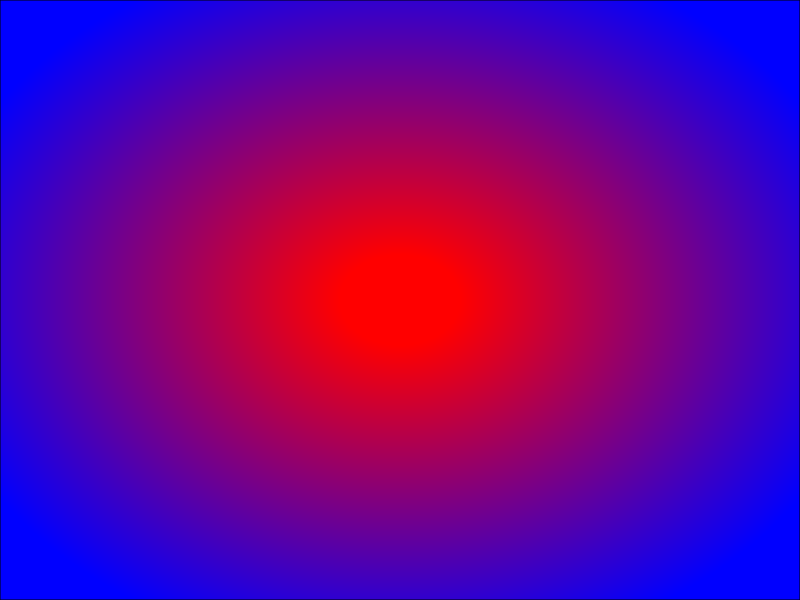

# MarkupGenerator.jl

| Status | Coverage |
| :----: | :----: |
| [](https://travis-ci.org/mkuegeler/MarkupGenerator.jl) | [](http://codecov.io/github/mkuegeler/MarkupGenerator.jl?branch=master) |

*A simple markup language generator*

This package provides a method to generate elements of a markup language. A markup language uses tags and attributes to define elements within a document.
The two most popular markup languages are HTML and XML.

The intent is to make it easier to create complex documents with parameters, like diagrams, animations and other visualizations.

"MarkupGenerator.jl" is written in the [Julia programming language](https://julialang.org).

## Installation
Currently, this package is not a registered package. To add it as an unregistered package, got to the Pkg REPL and specify the URL:
```julia
(v.1.5) pkg> add https://github.com/mkuegeler/MarkupGenerator.jl
```
We now can invoke the package in custom scripts.
```julia
using MarkupGenerator
```
using MarkupGenerator

## Getting Started

The package is language-agnostic, meaning that elements and attributes of any markup language can be generated as long as they base on named elements and assigned attributes.

For instance, to create a **"svg"** element, all you need to do is typing:

```julia
el = element("svg")
```

Adding an attribute to the element:

```julia
attributes = Dict("id"=>"root")
el = element("svg",attributes)
println(el)
```

**"svg"** is the element name and **"id"** is just one attribute with value **"root"**.

```xml
<svg id="root"/>
```

Furthermore, you can add children elements. In doing so, it's easy to create a nested structure of elements.

```julia
rect_attributes = Dict("id"=>"my rectangle")
rect = element("rect",rect_attributes)

svg_attributes = Dict("id"=>"root")
el = element("svg",svg_attributes,rect)
println(el)
```

Here is the output:

```xml
<svg id="root"><rect id="my rectangle"></rect></svg>
```

## Introducing Element Libraries

The core of the package serves as an abstraction layer for language-specific representations like HTML,XML or SVG. Element libraries and their attributes with sample values in JSON format facilitate the generation of element compositions.
Basically, these libraries are invocable as JSON files or on a more generic level via API calls requiring a definition of a dedicated API respectively.

The following example shows the **svg** element of an SVG application and its attributes.
[SVG](https://www.w3.org/TR/SVG11/intro.html) stands for Scalable Vector Graphics and is an application of XML to create highly detailed, resolution-independent, two-dimensional images in a truly portable format.

The JSON file **"svg.json"** in the assets directory contains common SVG elements. By following the scheme of the file, any other markup language can be invoked in a similar manner.

Load the JSON file from the assets directory:

```julia

svg_attributes = get_attributes(SVG,"svg")

```


Let's take a look at the svg element within **"svg.json"** :

```json
{
  "svg": {
    "style": "background-color:#cccccc;",
    "xmlns": "http://www.w3.org/2000/svg",
    "xmlns:xlink": "http://www.w3.org/1999/xlink",
    "preserveAspectRatio": "xMidYMid meet",
    "viewBox": "0 0 1282 721",
    "height": "100%",
    "width": "100%"
  }
}
```

You can use the predefined values of the element for your custom document.

```julia
svg_attributes = get_attributes(SVG,"svg")
el = element("svg",svg_attributes)
println(el)
```

What you get is a SVG document with attributes and values from the JSON file.

```xml
<svg viewBox="0 0 1282 721" height="100%" style="background-color:#cccccc;" xmlns:xlink="http://www.w3.org/1999/xlink" preserveAspectRatio="xMidYMid meet" xmlns="http://www.w3.org/2000/svg" width="100%"/>
```

## Recipes
Recipes make it more easier to create sophisticated documents with predefined parameters.

### Example: svg_doc_recipe
Let's start with a SVG document. It consists of a gradient background and comes with the following default parameters:

```json
{
  "svg_doc_recipe":{
    "description": "A simple svg document with radial gradient background",
    "x":"0",
    "y":"0",
    "width":"1024",
    "height":"768",
    "color1":"#ff0000",
    "color2":"#0000ff",
    "offset1":"10%",
    "offset2":"80%"
  }
}
```

To use the parameters for a custom document, create an instance of the default parameters and overwrite the values respectively.

```julia
params = get_attributes(RCP,"svg_doc_recipe")
# Set custom width and height
params["w"] = "800"
params["h"] = "600"

document = svg_doc_recipe(params)
println(document)
```

We get a valid SVG document:

```xml
<svg viewBox="0 0 800 600" height="100%" id="root" style="background-color:#cccccc;" xmlns:xlink="http://www.w3.org/1999/xlink" preserveAspectRatio="xMidYMid meet" xmlns="http://www.w3.org/2000/svg" width="100%">
  <style type="text/css"><![CDATA[ rect.aecbzkib{stroke-width:1;stroke:#000000;fill:url(#jkntnojj);}  ]]></style>
  <defs id="defs">
    <radialGradient cy="0.5" fx="0.5" spreadMethod="pad" id="jkntnojj" fy="0.5" r="0.75" cx="0.5">
      <stop offset="10%" stop-opacity="1" stop-color="#ff0000"/>
      <stop offset="80%" stop-opacity="1" stop-color="#0000ff"/>
    </radialGradient>
  </defs>
  <g id="main">
    <rect ry="0" height="600" class="aecbzkib" x="0" rx="0" width="800" y="0"/>
  </g>
</svg>
```

We can insert the code in a HTML document or write it to a file:


